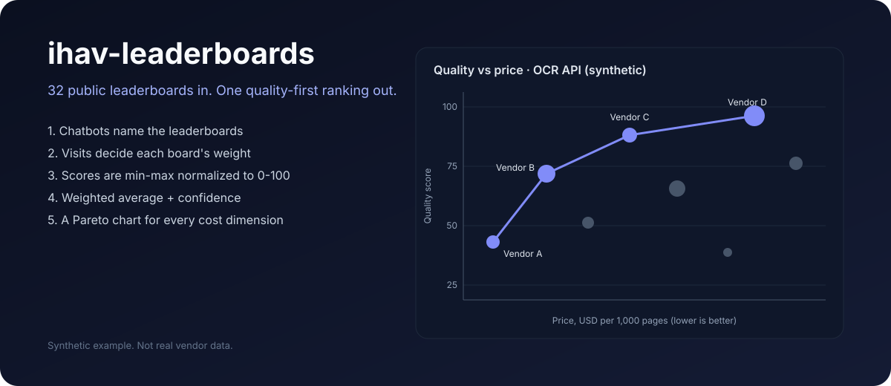
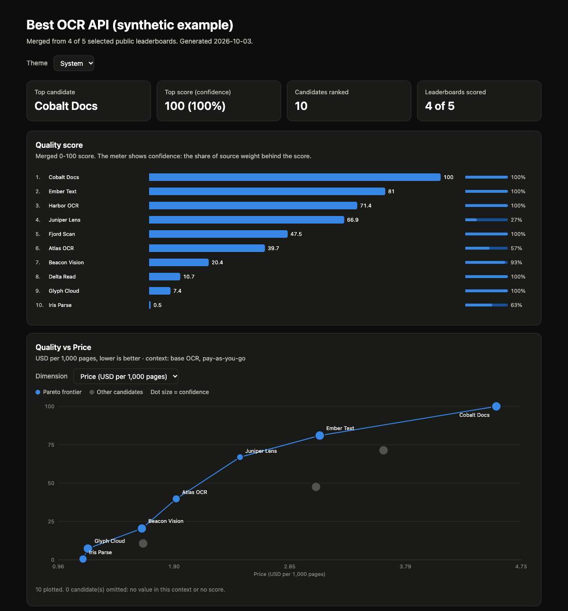

<p align="center">
  
</p>

<h1 align="center">ihav-leaderboards</h1>

<p align="center">Ask your coding agent "which OCR API is best?" and get one ranked table and one shareable chart page, built from the most-visited public leaderboards, with a confidence for every score and a Pareto chart for every cost.</p>

<p align="center">
  <a href="LICENSE"></a>
  
  
  
</p>

**Every leaderboard measures something different and ranks different candidates.** This plugin finds the leaderboards people actually visit, puts each one on the same 0-100 scale, and averages them with visit-based weights. It never fills a gap from memory: every number points back to a saved source.

[How it works](#how-it-works) · [Install](#install) · [Usage](#usage) · [The math](#the-math) · [Output](#output) · [Honest limits](#honest-limits)

## How it works

```text
"OCR API"
  1. discover   web chatbots (via ihav-web-chat) list public leaderboards
  2. collect    merge, dedupe, check every URL is live
  3. weigh      monthly visits per site (via ihav-web-visit-counter) -> keep the top 32
  4. extract    read each table: direct data -> real browser -> chatbot (verified)
  5. match      the agent matches candidate names across boards and records why
  6. score      min-max to 0-100 per board, visit-weighted average, confidence
  7. dimensions price, latency, ... with a Pareto frontier for each
```

Steps 1, 2, 4 and 5 are done by your agent, guided by the skill. Steps 3, 6 and 7 and the HTML report are a small, tested Python command with no dependencies and no network access.

## Install

Requires Python 3.9 or later. Install from the [ihav catalog](https://github.com/hiendang7613/ihav), which lists every public ihav plugin.

Claude Code (also installs ihav-web-visit-counter, which ihav-leaderboards needs):

```bash
claude plugin marketplace add hiendang7613/ihav
claude plugin install ihav-leaderboards@ihav
```

Codex has no dependency install, so add both plugins:

```bash
codex plugin marketplace add hiendang7613/ihav
codex plugin add ihav-web-visit-counter@ihav
codex plugin add ihav-leaderboards@ihav
```

This repository is also its own marketplace (`hiendang7613/ihav-leaderboards`). In Claude Code, add the ihav catalog first, because the dependency comes from there. Without it, Claude Code installs ihav-leaderboards but does not load it.

Discovery uses [ihav-web-chat](https://github.com/hiendang7613/ihav-web-chat), which is not released yet. Weighting uses [ihav-web-visit-counter](https://github.com/hiendang7613/ihav-web-visit-counter).

## Usage

Ask in plain language:

```text
Build a leaderboard of OCR APIs.
Which speech-to-text API gives the best quality for the price?
Merge the public leaderboards for text-to-image models, and use Perplexity too.
```

Or in Claude Code: `/ihav-leaderboards OCR API`. In Codex: `$ihav-leaderboards:ihav-leaderboards`.

The deterministic steps also run on their own:

```bash
python3 plugins/ihav-leaderboards/core/ihav-leaderboards/scripts/leaderboards.py new "OCR API"
python3 plugins/ihav-leaderboards/core/ihav-leaderboards/scripts/leaderboards.py weigh <run-folder>
python3 plugins/ihav-leaderboards/core/ihav-leaderboards/scripts/leaderboards.py score <run-folder>
python3 plugins/ihav-leaderboards/core/ihav-leaderboards/scripts/leaderboards.py render <run-folder>
python3 plugins/ihav-leaderboards/core/ihav-leaderboards/scripts/leaderboards.py verify <run-folder> --json
```

The file formats are in [the workflow reference](plugins/ihav-leaderboards/core/ihav-leaderboards/references/workflow.md).

`weigh` and `score` save input/output hashes and runtime receipts in `run_state.json`. `verify` reads them without changing the run. Exit 0 means the saved files are current; it does not establish provider delivery or human acceptance. Exit 2 means a busy run, no result or stale/incomplete state; wait for a busy writer without editing inputs, otherwise inspect the diagnostic; exit 64 means malformed input; exit 1 means local I/O failed. Re-run local `weigh`/`score` after input or runtime changes. Reuse saved discovery and child run IDs; never resend a chatbot request to repair a local result.

Before another attempt, generated outputs are copied and hash-checked in `.history/<timestamp-id>/` before originals are removed. The manifest records verified copies and removal progress. A storage failure can leave old files at the run root with a failed receipt; they are not current reports. Inspect `diagnostic.json` and the archive manifest before recovery. Four report files are valid as a group only after the final receipt is committed and `verify` succeeds. Older runs without receipts need local `weigh`/`score` once. `render` can rebuild a missing HTML file when the score inputs and other outputs remain current.

## The math

For each leaderboard `L` and candidate `c` with a usable score (error rates such as CER are inverted first):

```text
norm_L(c)     = 100 * (q_c - min_L) / (max_L - min_L)
w_L           = allocated visits of L / sum over scored boards
final(c)      = sum(w_L * norm_L(c)) / sum(w_L)      over the boards that score c
confidence(c) = sum(w_L)                             over the boards that score c
```

- **Weights.** A site's monthly visits are split equally across its leaderboards in the set. A site with only a rank gets the smallest known visit count as a floor. If no site has a visit estimate, there is no score and you get a diagnostic instead of made-up equal weights.
- **Missing scores** do not count as zero. A candidate on one small board can score 100 with 4% confidence, and the table shows both numbers.
- **Dropped boards.** A board with fewer than 3 usable scores, or with all scores equal, is reported but not scored. Boards that only give an order (rank 1, 2, 3) are reported but not mixed into the score.
- **Pareto.** For each dimension such as price, a candidate is on the frontier when no other candidate is at least as good on both axes and better on one. Only values from the same comparable context are compared, so "base OCR price" never competes with "layout OCR price".

## Output

Every run lives in `.ihav_space/ihav-leaderboards/runs/<run-id>/` in your project:

```text
request.json  boards.json  visits/  weights.json  leaderboards/  matches.json
dimensions.json  run_state.json  final.json  leaderboard.md  leaderboard.csv  report.html
```

`report.html` is one static page you can open or share: a ranking with confidence meters, quality-vs-dimension Pareto charts, numeric dimension bars, a coverage grid, leaderboard weights and a sortable table. It shows traffic periods, floor/split policy, matching evidence, comparable dimension sources/conflicts and chart omissions. Light and dark themes.

Extraction needs a saved source snapshot with its SHA-256 and a cell reference for each explicitly verified row. Conflicting duplicate values need one agent-selected `preferred: true` row with identity evidence. Hashes identify saved bytes; they do not prove that the extraction was accepted by a person. CSV keeps numeric columns and appends `synthetic`; fabricated fixtures carry a visible label in every report format.

<p align="center">
  
</p>

A complete synthetic run, with every file, is in [`examples/synthetic-ocr/`](examples/synthetic-ocr/). Open its [`report.html`](examples/synthetic-ocr/report.html) locally.

Synthetic example of `leaderboard.md`:

```text
| # | Candidate | Score | Confidence | price |
|---|---|---|---|---|
| 1 | Vendor D  | 94.1 | 88% | 9.0 |
| 2 | Vendor C  | 90.3 | 71% | 4.5 |
| 3 | Vendor B  | 81.7 | 93% | 2.0 |
| 4 | Vendor A  | 55.2 | 12% | 0.8 |
```

Add `.ihav_space/` to your `.gitignore`. The plugin warns you and never edits the file.

## Honest limits

- **Visits are estimates.** They come from a public traffic model, not the sites' own analytics. Weights are allocated site popularity, not page visits.
- **Discovery needs ihav-web-chat, which is not released yet.** Until it is, the agent cannot run step 1 automatically. Its current local build can preview and queue a request, but it has no command that sends one, and it lists ChatGPT only. Every send needs your approval of the exact prompt.
- **Chatbots can be wrong.** They only propose leaderboards. Every URL is checked, and a table read by a chatbot is scored only after it is checked against the page.
- **No bypass.** On 401, 403, 429, a captcha or a bot wall, that source is skipped.
- **Unofficial automation.** ihav-web-chat drives consumer chatbot websites with your own accounts. That can break a provider's terms. The choice is yours.
- **Alpha.** The skill workflow has not yet been run end to end against live leaderboards; the scoring and report code is covered by offline tests.

## Development

```bash
python3 -m unittest discover -s tests -t tests
```

The tests run offline. See [CONTRIBUTING.md](CONTRIBUTING.md) and the full [design](docs/design.md).

## License

MIT. See [LICENSE](LICENSE).
